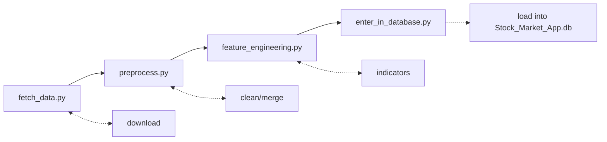

# Data pipeline
> Four scripts, meant to be run in order, turning raw Yahoo Finance data into rows in the exchange's SQLite database:



## 1. `fetch_data.py`
Downloads OHLCV history from Yahoo Finance via `yfinance` and writes it into `Datasets/raw/<timestamp>_fetched_data.csv`, using the same long format (`Ticker,Date,Open,High,Low,Close,Adj Close,Volume`) already used by the existing `Datasets/Dataset_By_Year(Smaller)/*.csv` files.
```bash
python3 fetch_data.py \
    -- tickers AAPL MSFT GOOG \ (the tickers to fetch, space-separated, or a file with one ticker per line)
    --tickers-file tickers.txt \ (a file with one ticker per line, instead of the `--tickers` list)
    --small-tickers (top 10 large US stocks) \
    -full-tickers (the major world indices) \
    (mutually exlusive groups) \
    --start 2010-01-01 \ (the start date for the history)
    --end 2024-01-01 \ (the end date for the history)
    --period 1d \ (the length of the history to fetch, e.g. 1y for one year, 5y for five years, max for the full history)
    --interval 1d \ (the interval of the bars, e.g. 1d for daily, 1wk for weekly, 1mo for monthly)
    --output Datasets/raw/2024-01-01_fetched_data.csv \ (the output CSV file)
```


## 2. `preprocess.py`
Reads every source it can find (the legacy wide-format `Stock_Market_Initial_Data.csv`, the long-format yearly CSVs, and anything `fetch_data.py` wrote into `Datasets/raw/`) and normalizes all of it into one canonical table, cleaning missing values and duplicates along the way:
```text
ticker, date, open, high, low, close, adj_close, volume
```
Output: `Datasets/processed/all_prices.csv`
```bash
python3 preprocess.py \
    --keep-only-fetched \ (ignore the legacy CSVs, only keep the data from fetch_data.py)
    --min-rows 1000 \ (ignore tickers with less than 1000 rows of data)
    --max-rows 10000 \ (a bit confusing, but the max history lenght to keep, not the number of rows to keep)
    --input Datasets/raw/2024-01-01_fetched_data.csv \
    --output Datasets/processed/all_prices.csv
```


## 3. `feature_engineering.py`
Reads `all_prices.csv` and computes, per ticker: returns, SMA_50/SMA_200, EMA_20/EMA_50, momentum (4 and 10), RSI_14, the stochastic oscillator, volatility (10 and 20, and the annualized 20-day volatility of log returns), MACD and its signal, and Bollinger bands. `--use-common-features` writes only the 12 features the forecasting models use (`COMMON_FEATURE_COLS`, the same as `Forecasting/forecasting/features.py`).

Outputs:
- `Datasets/processed/features.csv`: the full daily feature table
- `Datasets/processed/latest_snapshot.csv`: one row per ticker with the most recent price and volatility, which is exactly the shape `Src_Simulation`'s `SymbolConfig` wants (`initial_price` and a realistic scale for a bot's random price offsets), instead of arbitrary made-up numbers
```bash
python3 feature_engineering.py \
    --input Datasets/processed/all_prices.csv \
    --use-common-features \ (only compute the most common ML features for ML models)
    --output Datasets/processed/features.csv \
    --summary-output Datasets/processed/latest_snapshot.csv
```


## 4. `enter_in_database.py`
Loads `all_prices.csv` into the same SQLite database `Src_SQL`'s C++ server reads (`Stock_Market_App.db` by default): one row per ticker into the `actions` table, and its full close-price history into the `prices` table. 
It's additive and idempotent: safe to re-run, it never touches `clients`/`orders`/existing rows, and only inserts price rows that aren't already
present for a given (action, date).
```bash
python3 enter_in_database.py \ 
    --db Stock_Market_App.db \ 
    --input Datasets/processed/all_prices.csv
    --tickers AAPL MSFT GOOG \ (only load these tickers, instead of everything in the CSV)
    --outstanding-quantity 1000 \ (set the initial outstanding quantity for each ticker, instead of the default 100_000)
```

**Important:** the `date_time`/`daily_time` columns in the `prices` table are not Unix timestamps: they're the custom integer encoding `Src_SQL/utility.cpp` uses (`get_date_time`/`get_daily_time`). `enter_in_database.py` replicates that exact formula so historical rows sort correctly against rows the live C++ server writes, see the comment at the top of the script if that encoding ever changes on the C++ side.

Seeding demo *clients* (as opposed to actions and prices) is `server.x init`'s job (see `Src_SQL/scripts/launch_multi_client.sh`, whose `--reload_prices` runs this whole pipeline).
