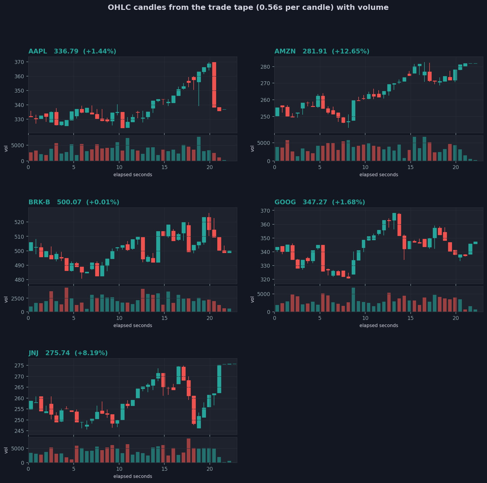
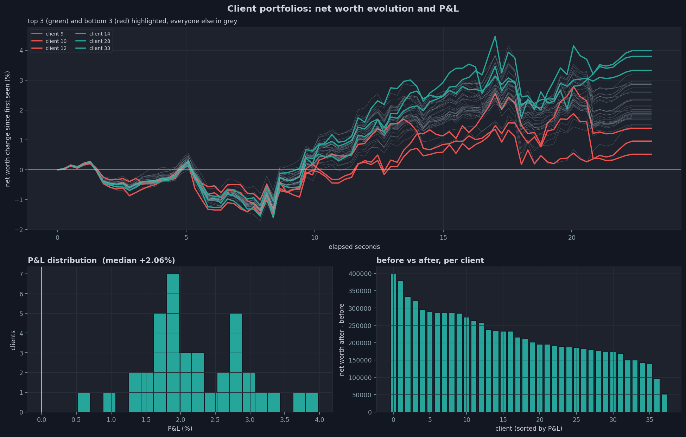
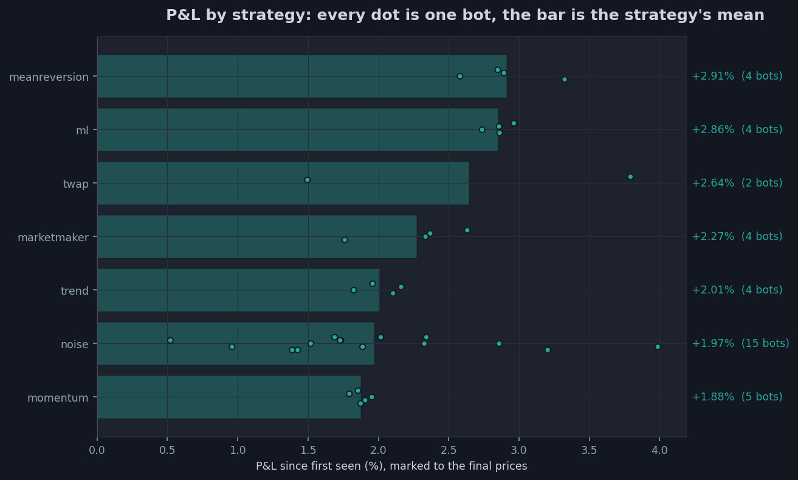
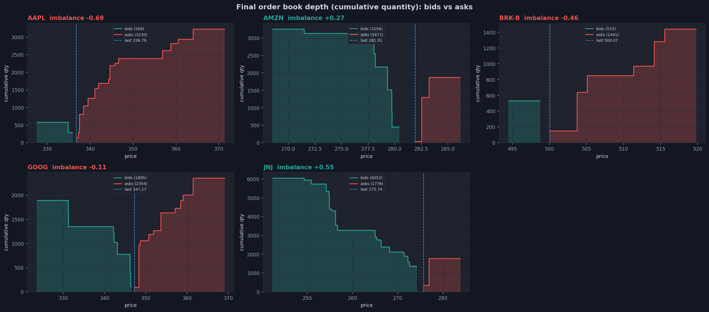
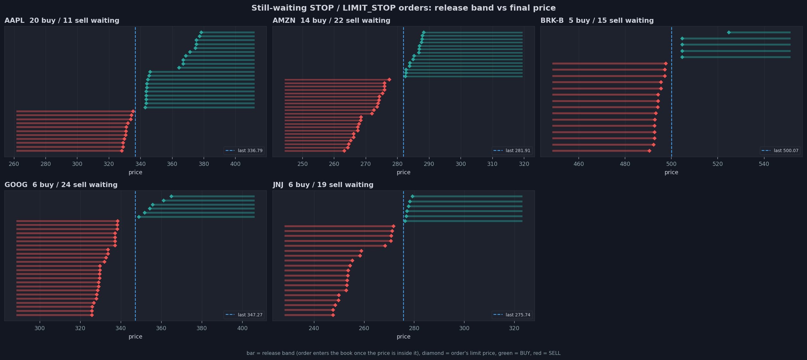
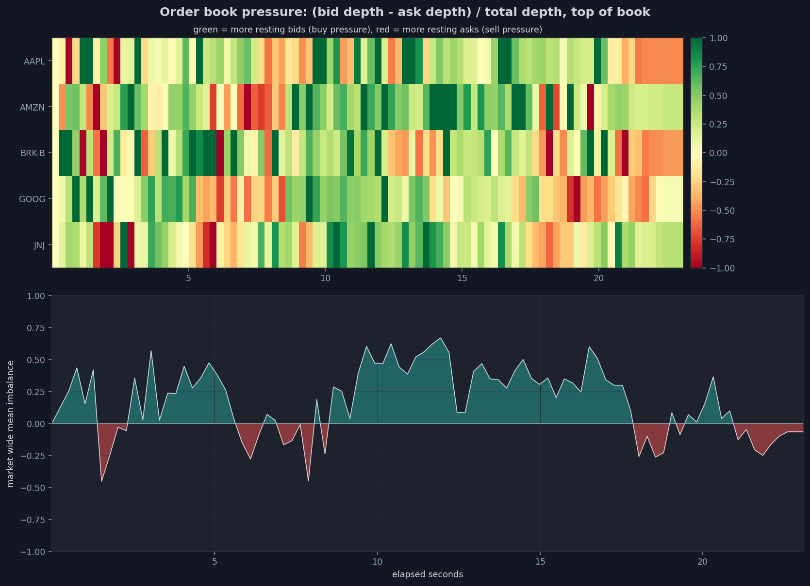
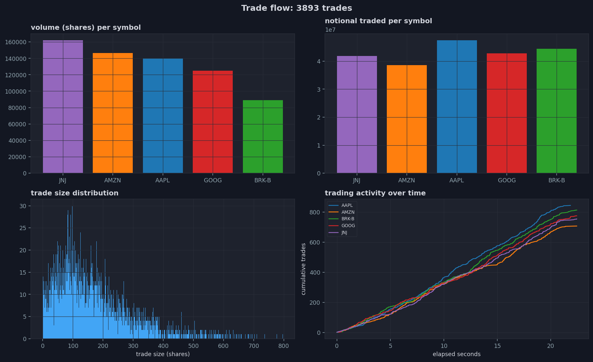

# Stock Market Trading Simulator
A stock exchange built from scratch in C++, twice, and a machine learning project that trades on it:
- **`Src_SQL`**: a complete exchange backed by SQLite, with a real market session (opening auction, continuous trading, closing auction), encrypted accounts, and scripted clients that can trade real index prices downloaded from Yahoo Finance.
- **`Src_Simulation`**: a dependency-free, in-memory exchange built for speed and research: seven trading strategies (market making, trend following, mean reversion, TWAP execution, a machine learning signal trained in Python and run in C++...), a multi-threaded TCP server, trading days that chain from one session to the next, and an end-of-run market report with trading-terminal charts.
- **`Forecasting`**: forecasting models, anomaly detectors and reinforcement learning agents trained on every ticker, judged on data they never saw, and served live to the simulator's bots.

All three are fed by the same Python data pipeline (`Data/`), and the in-memory engine is covered by 130 non-regression tests (`NRT/`), all passing, also under AddressSanitizer.

<p align="center">
  
</p>


## Quick start
**The in-memory exchange and its bots** (only `make` and a C++20 compiler, plus Python with pandas and matplotlib for the charts):
```bash
cd Src_Simulation
./launch.sh                              # ~45 s: 36 bots in-process, then a server with 9 network bots
open output/latest/plots/index.html      # every chart and the market report of both phases
```
**The SQL exchange** (macOS with Homebrew: `brew install sqlite openssl@3 fmt sdl2 sdl2_ttf sdl2_image`):
```bash
cd Src_SQL && make
./server.x reset && ./server.x init && ./server.x play        # terminal 1
./client_account.x Client1 123                                # terminal 2, then: BUY 1 1 MARKET
./client_account.x Client2 123                                # terminal 3, then: SELL 1 1 MARKET
```
or with scripted clients on real prices: `cd Src_SQL/scripts && ./launch_multi_client.sh 20 6 30 --terminals --use_real_prices`

**The tests**: `cd NRT && make test`


## How to run it
Every command below runs from the project root. Each part's README lists every option.

**Trade real tickers:** Fetch prices first (needs network), the simulator then lists the real tickers at their last real price, with their real volatility, and the ML bot retrains on them:
```bash
Src_Simulation/scripts/refresh_data.sh small         # 10 large US stocks, 5 years of daily bars
Src_Simulation/scripts/refresh_data.sh full          # or the world indices of Data/tickers.txt
Src_Simulation/launch.sh                             # both phases, on those tickers
```

**Bigger, longer, or one phase only:**
```bash
Src_Simulation/launch.sh simu --simu-duration 300 --symbols 8 --noise 60 --marketmakers 12   # in-process only
Src_Simulation/launch.sh bots --bots 14 --bots-duration 120                                  # network session only
Src_Simulation/launch.sh --ml 4 --train-ml                                                   # retrain the ML bots first
```

**Trade by hand against the bots**, in two terminals:
```bash
cd Src_Simulation
./sim_server.x --port 7878                                        # terminal 1
./sim_client.x alice secret --register                            # terminal 2, then for example:
#   SYMBOLS
#   ORDER BUY AAPL 100 LIMIT PRICE=170
#   PORTFOLIO          (cash, what open orders reserve, holdings)
./sim_client.x bot1 pw --register --bot marketmaker --duration-sec 300   # add a bot whenever you like
```

**Several trading days.** With a snapshot, stopping the server ends the day like a real exchange: a pre-close, a closing auction setting each symbol's official close, DAY orders expiring, and good-till-cancelled orders carried to the next day. The next start reloads accounts, positions, closing prices and open orders:
```bash
cd Src_Simulation
./sim_server.x --snapshot output/day.snapshot --closing-auction 5    # day 1: trade, then Ctrl-C
./sim_server.x --snapshot output/day.snapshot --closing-auction 5    # day 2 opens at day 1's closes
#   ORDER BUY AAPL 50 LIMIT PRICE=150 TIF=GTC     (kept from one day to the next until filled or cancelled)
scripts/launch_bots.sh --duration 60 --closing-auction 10            # a bots session whose last 10 s are the pre-close
```

**Machine learning models as bots.** Train in `Forecasting/`, compare the models, then let them trade:
```bash
cd Forecasting && pip install -r requirements.txt
python -m forecasting.selftest                                       # checks everything installed works
python -m forecasting.train --config configs/trend_xgboost.json --tune
python -m forecasting.train --config configs/trend_lstm.json
python -m forecasting.train --config configs/anomaly_zscore.json
python -m forecasting.train --config configs/rl_qlearning.json
python -m forecasting.scorecard --artifacts artifacts/*              # Sharpe, drawdown, stability, robustness
cd ../Src_Simulation && ./launch.sh --forecast                       # starts the forecast server, adds the bots
```


## The project
| Folder | What it is | Details |
|---|---|---|
| [`Src_Simulation/`](Src_Simulation/README.md) | in-memory exchange, strategies, TCP server and client, trading days, market report, charts | [README](Src_Simulation/README.md) |
| [`Src_SQL/`](Src_SQL/README.md) | SQLite exchange with market phases and scripted clients | [README](Src_SQL/README.md) |
| [`Forecasting/`](Forecasting/README.md) | forecasting, anomaly detection and reinforcement learning on every ticker, a scorecard, a live forecast server | [README](Forecasting/README.md) |
| [`NRT/`](NRT/README.md) | 130 non-regression tests for `Src_Simulation` | [README](NRT/README.md) |
| [`Data/`](Data/README.md) | Yahoo Finance download, cleaning, features, database loading | [README](Data/README.md) |
| [`Test_Functionnalities/`](Test_Functionnalities/README.md) | the experiments behind the design: mutexes, sockets, password encryption, SQL in C++ | [README](Test_Functionnalities/README.md) |


## Two engines, two goals
| | `Src_SQL` | `Src_Simulation` |
|---|---|---|
| state | SQLite database, every event stored | in memory, with an optional snapshot across restarts |
| market | pre-open, opening auction, continuous trading, pre-close, closing auction | continuous trading, then on stop a pre-close and closing auction, sessions chained day after day |
| orders | MARKET, LIMIT, STOP, LIMIT_STOP, validity date | the same, plus start dates, side-aware STOPs, a MARKET price collar, DAY and GTC time in force |
| accounts | AES-encrypted passwords | salted SHA-256 hashes, session tokens, balanced starting accounts, cash and share reservations |
| clients | interactive client, scripted clients | interactive client, 7 bot strategies in-process or over TCP, ML bots |
| protocol | raw TCP text | length-prefixed frames |
| output | before and after summaries, message log | logs, metrics, a 10-file market report, charts, HTML |
| speed | bounded by a database write for every event | about 300 orders per second with 36 bots, 7 &micro;s mean submit latency |


## Machine learning
Two levels, from simple to complete:
- **In the simulator** (`Src_Simulation`): a logistic regression on five price features, trained in Python on the fetched real market and evaluated natively in C++ by the `ml` bots. The model learned from daily closes, so the bot reads the simulated market in bars, one bar playing one trading day. An NRT test keeps the Python and C++ feature code identical.
- **`Forecasting/`**, a project of its own:
  - **models**: XGBoost on a snapshot of indicators, and sequence models (LSTM, GRU, Transformer, TCN) readind a whole window of the market, order book included, for return and trend prediction,
  - **anomaly detection** (z-score, Isolation Forest, neural autoencoders) driving an arbitrage decision (trade against an abnormal move), and pairs trading,
  - **reinforcement learning** agents learning a trading policy (Q-learning, DQN, policy gradient),
  - **pretrained components**: ticker embeddings, a self-supervised encoder, Amazon's Chronos,
  - **configurable training and tuning**: preprocessing options, losses, optimizers, sizes, grid, random, successive halving or Bayesian search, always validated forward in time,
  - **a scorecard** judging every model on data it never saw: Sharpe, drawdown and other trading metrics, and stability, robustness to costs and noise, calibration, graded into a robustness score,
  - **a live forecast server**: the simulator streams every tick of the order book to it, it scores its own forecasts as the market moves, detects regime changes, and retrains its models in the background, keeping a new version only if it does better on the newest data.

In the simulator, each model trades as its own bots, plus an ensemble combining a classifier and a
regressor. Bots skip forecasts that arrive too late, and a model is never evaluated on the market it learned from.


## Data
`Data/` downloads daily prices from Yahoo Finance (world indices from `Data/tickers.txt`, or large US stocks), cleans and merges them, computes returns, moving averages, volatility and RSI, and loads them into the SQL exchange's database. `Src_Simulation` reads the latest prices and volatility directly from the processed files, so its bots trade real tickers from their real last price and with their real volatility. The ML bot and `Forecasting/` train on the full history. See [Data/README.md](Data/README.md).


## What the market report looks like
| | |
|---|---|
| **Portfolios**: every bot's net worth during the simulation, and the P&L distribution | **Strategies**: the P&L of every bot strategy, one dot per bot |
|  |  |
| **Depth**: the order book at the end of the simulation, with the last price and the best bid and ask | **Waiting orders**: every waiting STOP order's trigger band against the final price |
|  |  |
| **Order book pressure**: the imbalance between buy and sell orders over time | **Trade flow**: volume, notional and trade sizes per symbol |
|  |  |


## Highlights
- **Correctness first**: open orders reserve cash and shares, so an account can never be over-committed. The report checks on every run that cash is conserved and nobody ends overdrawn.
- **A fair market**: every account starts balanced by value (half cash, half stock split equally across symbols) and orders are sized by value, so index-priced symbols no longer make every bot a seller.
- **One strategy, two transports**: every bot is written once against a `MarketGateway` and runs unchanged in-process or as a real network client.
- **Trading days**: time in force (DAY, good till cancelled, good till date), a closing auction setting the official close, and a snapshot carrying accounts, closes and open orders to the next session, which opens with an auction.
- **Honest machine learning**: models are trained on real data, scored only on periods and markets they never saw, and compared with naive baselines and buy-and-hold before they are trusted.
- **Bugs found by measuring, and pinned by tests**: over-committed accounts, cancelling other clients' orders, a server killed by one client disconnecting, BUY stops that pushed every price up, a market maker that doubled volatility, trading that continued after the close. Each has its regression test, see [NRT/README.md](NRT/README.md).


## Repository layout
```text
Stock_Market_Trading_Simulator/
├── Data/
│   fetch_data.py preprocess.py feature_engineering.py enter_in_database.py tickers.txt
│   README_Pictures/ (the charts of this README)
│
├── Forecasting/
│   ├── forecasting/   (features, data, models, rl, tuning, backtest, scorecard, online, serve, selftest)
│   ├── configs/       (one JSON per experiment)
│   └── artifacts/     (trained models)
│
├── NRT/
│   test_*.cpp nrt_framework.hpp Makefile output/ (files written by the tests)
│
├── Src_Simulation/
│   ├── include/
│   ├── src/
│   ├── scripts/
│   ├── launch.sh
│   ├── models/        (the ML bots' model)
│   └── output/        (one folder per run)
│
├── Src_SQL/
│   *.cpp *.hpp makefile scripts/ (launcher, order generator, logs)
│
└── Test_Functionnalities/
    ├── Mutex/
    ├── Sockets/
    ├── Password_Cryptage/
    └── SQL_in_cpp/
```
