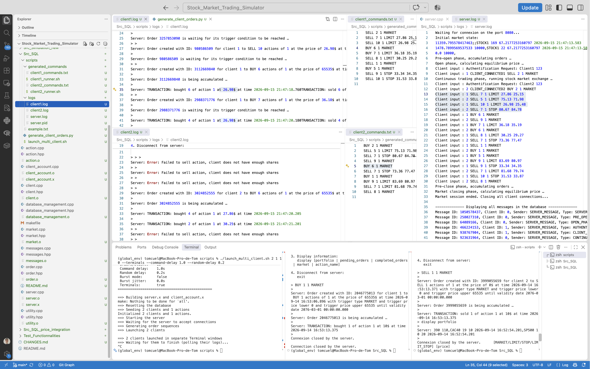

# Src_SQL: the SQLite-backed exchange
> The first engine of the project: a stock exchange server whose whole state (clients, actions, orders, prices, messages) lives in a SQLite database, with human or scripted clients connecting over TCP. 
It runs a full **market session** with the same phases as a real exchange (pre-open, opening auction, continuous trading, pre-close, closing auction) and supports four order types.

`Src_Simulation` is the second engine: in-memory, much faster, with a length-prefixed protocol and
trading bots. 
The two are independent. 
`Src_SQL` is the place to see how an exchange works end to end with a real database behind it.


## Contents
| File | Role |
|---|---|
| `server.cpp` | the exchange: accepts clients (one thread each), runs the market session, the trigger/expiration watcher thread, and the command-line modes (`reset`, `init`, `init_clients`, `play`) |
| `market.cpp / .hpp` | the order books (`Buy_Orders` / `Sell_Orders` per action, kept sorted by price-time priority), the opening/closing auction (`process_fixing`) and continuous matching (`process_continuous_trading`) |
| `client.cpp / .hpp` | a client account: balance, portfolio, pending/waiting/completed orders, `can_afford`, `deposit`, `withdraw` |
| `order.cpp / .hpp`, `action.cpp / .hpp` | an order and a listed action (stock or index), read from and written to the database |
| `messages.cpp / .hpp` | every event (orders, transactions, phase changes, connections) is stored as a message in the database |
| `database_management.cpp / .hpp` | the SQLite layer: schema creation, queries, reset |
| `utility.cpp / .hpp` | shared helpers: time encoding, AES password encryption (OpenSSL), constants such as `SERVER_PORT` (8080) |
| `client_account.cpp` | the interactive client program (`client_account.x`) |
| `read_database.cpp` | a small tool (`read_database.x`) that prints the database content |
| `scripts/launch_multi_client.sh` | spins up the server and N scripted clients (see below) |
| `scripts/generate_client_orders.py` | writes each scripted client's list of orders |

Database tables: `clients`, `actions`, `prices`, `orders`, `client_portfolio`, `messages`, `encryption_keys`. Passwords are stored encrypted (AES-256-CBC, key and IV kept in `encryption_keys`).


## The market session
`./server.x play` runs one session, phase after phase
1. **Pre-open:** orders are accumulated, nothing trades
2. **Open (fixing):** an opening auction computes the equilibrium price that maximizes the traded
   volume, and executes the accumulated orders at that single price
3. **Continuous trading:** every incoming order is matched immediately against the book, by price
   then time priority. A watcher thread polls the waiting orders (LIMIT, STOP, LIMIT_STOP not yet
   triggered, or not yet started) and releases or expires them
4. **Pre-close:** orders are accumulated again
5. **Close (fixing):** a closing auction, then every client is disconnected and the session ends

The duration of each phase is a server setting (see the launcher's `--pre_open_time_delay`, `--open_time_delay`, `--continuous_trading_time_delay`, `--pre_close_time_delay`).


## Orders
```
[BUY/SELL] [quantity] [action_id] [MARKET/LIMIT/STOP/LIMIT_STOP] [price] [trigger_price_lower] [trigger_price_upper] [validity_date: YYYY-MM-DD] [validity_time: HH:MM:SS]
```
| Type | Parameters | Behaviour |
|---|---|---|
| `MARKET` | none | trades immediately against the best opposite orders |
| `LIMIT` | price, lower trigger | trades at the limit price or better |
| `STOP` | price, upper trigger | waits for its trigger, then enters the book |
| `LIMIT_STOP` | price, lower and upper triggers | waits until the price is inside the band |

The client can also `amount <value> deposit|withdraw` and `display portfolio | pending_orders | completed_orders | market | <action_name>`, and `exit`


## Build
Dependencies (macOS with Homebrew, as in the `makefile`): `sqlite3`, `openssl@3`, `fmt`, `sdl2`, `sdl2_ttf`, `sdl2_image` (`SDL2`originally supposed to be used for a GUI, but the current version is terminal-only, so not required afterward).
```bash
# brew install sqlite openssl@3 fmt sdl2 sdl2_ttf sdl2_image
brew install sqlite openssl@3 fmt
cd Src_SQL
make            # server.x, client_account.x, read_database.x
```


## Running it by hand
Three terminals. The database is reset and filled with the demo setup (2 actions: CAC40 and SP500, 2 clients: Client1 and Client2, password `123`), then the session is played:
```bash
./server.x reset && ./server.x init     # terminal 1
./server.x play
./client_account.x Client1 123          # terminal 2
./client_account.x Client2 123          # terminal 3
```

Here is how it looked like in my vscode window: 
<p align="center">
  
</p>

The copy of the three terminals above is in `scripts/example.txt`. The server prints every message it receives, and the clients print the server's responses.
The "by-hand" session is the following: **Client1 buys one CAC40 at market, Client2 sells one, they trade at 10$**.
Others scenarios are possible: the clients can place LIMIT, STOP or LIMIT_STOP orders, and the server will accumulate them until they are triggered or expired. 
They were tested by hand but not documented here, launcher integrate them and we can inspect if everything is working as expected by reading the database and the logs at the end of the session.

### Server's side
```text
(global_env) tomcuel@MacBook-Pro-de-Tom Src_SQL % ./server.x play
Waiting for connexion on the port 8080...
Initial market state:
400;;CAC40 20 10.0 2026-09-14 16:52:54.201,SP500 10 20.0 2026-09-14 16:52:54.201
0.0 1000,
400 100,CAC40 20 10 2026-09-14 16:52:54.201,SP500 10 20 2026-09-14 16:52:54.201
Pre-open phase, accumulating orders …
Open phase, calculating equilibrium price …
Client input : Authentification Request: Client1 123
Client input : 1 CLIENT_CONNECTED
Client input : Authentification Request: Client2 123
Client input : 2 CLIENT_CONNECTED
Continuous trading phase, running stock market exchange …
Client input : 1 BUY 1 1 MARKET
Client input : 2 SELL 1 1 MARKET
Client input : 2 display portfolio
Pre-close phase, accumulating orders …
Market closing phase, calculating equilibrium price …
Market session ended. Closing all client connections...

-------------- Displaying all messages in the database --------------
Message ID: 1942912906, Client ID: 0, Sender: SERVER_MESSAGE, Type: SERVER_RESTART, Content: Server launched,Time: 2026-09-14 16:53:01.082
Message ID: 2298065420, Client ID: 0, Sender: SERVER_MESSAGE, Type: PRE_OPEN_PHASE, Content: Market pre-open phase, accumulating orders,Time: 2026-09-14 16:53:01.087
Message ID: 1226608731, Client ID: 0, Sender: SERVER_MESSAGE, Type: OPEN_PHASE, Content: Market open phase (fixing),Time: 2026-09-14 16:53:02.088
Message ID: 507969729, Client ID: 1, Sender: SERVER_MESSAGE, Type: AUTHENTIFICATION_SUCCESS, Content: Authentification success,Time: 2026-09-14 16:53:02.142
Message ID: 3477974380, Client ID: 1, Sender: SERVER_MESSAGE, Type: CLIENT_CONNECTED, Content: Client connected,Time: 2026-09-14 16:53:02.143
Message ID: 2431394175, Client ID: 2, Sender: SERVER_MESSAGE, Type: AUTHENTIFICATION_SUCCESS, Content: Authentification success,Time: 2026-09-14 16:53:02.437
Message ID: 3633305575, Client ID: 2, Sender: SERVER_MESSAGE, Type: CLIENT_CONNECTED, Content: Client connected,Time: 2026-09-14 16:53:02.437
Message ID: 3328102999, Client ID: 0, Sender: SERVER_MESSAGE, Type: CONTINUOUS_TRADING_PHASE, Content: Market continuous trading phase,Time: 2026-09-14 16:53:03.090
Message ID: 3793068579, Client ID: 1, Sender: CLIENT_MESSAGE, Type: ORDER, Content: Order created with ID: 2046775013 for client 1 to BUY 1 actions of 1 at the price of 65535$ at time 2026-09-14 16:53:06.896 with trigger type MARKET and trigger price lower 0 and trigger price upper 65535 until validity date 2076-03-01 00:00:00.000,Time: 2026-09-14 16:53:06.896
Message ID: 1192562745, Client ID: 1, Sender: SERVER_MESSAGE, Type: ACCUMULATING_ORDER, Content: Accumulating the order …,Time: 2026-09-14 16:53:06.897
Message ID: 531118870, Client ID: 2, Sender: CLIENT_MESSAGE, Type: ORDER, Content: Order created with ID: 3999055659 for client 2 to SELL 1 actions of 1 at the price of 0$ at time 2026-09-14 16:53:13.371 with trigger type MARKET and trigger price lower 0 and trigger price upper 65535 until validity date 2076-03-01 00:00:00.000,Time: 2026-09-14 16:53:13.371
Message ID: 3082622198, Client ID: 2, Sender: SERVER_MESSAGE, Type: ACCUMULATING_ORDER, Content: Accumulating the order …,Time: 2026-09-14 16:53:13.373
Message ID: 1710467178, Client ID: 0, Sender: SERVER_MESSAGE, Type: TRANSACTION, Content: Transaction of 1 actions 1 at the price of 10$ between buyer 1 and seller 2 at time 2026-09-14 16:53:13.375,Time: 2026-09-14 16:53:13.375
Message ID: 2093523829, Client ID: 2, Sender: CLIENT_MESSAGE, Type: DISPLAY_PORTFOLIO, Content: Display portfolio,Time: 2026-09-14 16:53:21.969
Message ID: 1573670660, Client ID: 0, Sender: SERVER_MESSAGE, Type: PRE_CLOSE_PHASE, Content: Market pre-close phase (fixing),Time: 2026-09-14 16:53:33.209
Message ID: 1589967834, Client ID: 0, Sender: SERVER_MESSAGE, Type: CLOSE_PHASE, Content: Market close phase, accumulating orders,Time: 2026-09-14 16:53:34.216
Message ID: 1397381684, Client ID: 0, Sender: SERVER_MESSAGE, Type: SERVER_SHUTDOWN, Content: Server shutdown,Time: 2026-09-14 16:53:34.559
-------------- End of messages in the database --------------
```

At the end, the server prints every message stored in the database:
```text
Message ID: 1710467178, Client ID: 0, Sender: SERVER_MESSAGE, Type: TRANSACTION, Content: Transaction of 1 actions 1 at the price of 10$ between buyer 1 and seller 2 at time 2026-09-14 16:53:13.375,...
```

### Client1's side
```text
(global_env) tomcuel@MacBook-Pro-de-Tom Src_SQL % ./client_account.x Client1 123
Client launched...
Serveur authentification response: AUTHENTIFICATION_SUCCESS 1
Connected to the server !
Enter one of the following commands:
1. Place an order:
   [BUY/SELL] [quantity] [action_id] [MARKET/LIMIT/STOP/LIMIT_STOP] [price] [trigger_price_lower] [trigger_price_upper] [validity_date: YYYY-MM-DD] [validity_time: HH:MM:SS]
   Notes:
     - For MARKET:        do NOT provide price, trigger_price_lower or trigger_price_upper
     - For LIMIT:         provide [price] and [trigger_price_lower] only
     - For STOP:          provide [price] and [trigger_price_upper] only
     - For LIMIT_STOP:    provide [price], [trigger_price_lower] and [trigger_price_upper]

2. Modify client balance:
   amount [value] [deposit/withdraw]

3. Display information:
   display [portfolio | pending_orders | completed_orders | market | action_name]

4. Disconnect from server:
   exit

> BUY 1 1 MARKET
> 
Server: Order created with ID: 2046775013 for client 1 to BUY 1 actions of 1 at the price of 65535$ at time 2026-09-14 16:53:06.896 with trigger type MARKET and trigger price lower 0 and trigger price upper 65535 until validity date 2076-03-01 00:00:00.000
> 
Server: Order 2046775013 is being accumulated …
> 
Server: TRANSACTION: bought 1 of action 1 at 10$ at time 2026-09-14 16:53:13.375
> 
Connexion closed by the server.

Connection closed by the server.
```

The "price of 65535$" is not what the client pays: it is the priority placeholder that puts a MARKET buy at the front of the book. 
The trade settles at the real counterparty price, 10$.

### Client2's side
```text
(global_env) tomcuel@MacBook-Pro-de-Tom Src_SQL % ./client_account.x Client2 123
Client launched...
Serveur authentification response: AUTHENTIFICATION_SUCCESS 2
Connected to the server !
Enter one of the following commands:
1. Place an order:
   [BUY/SELL] [quantity] [action_id] [MARKET/LIMIT/STOP/LIMIT_STOP] [price] [trigger_price_lower] [trigger_price_upper] [validity_date: YYYY-MM-DD] [validity_time: HH:MM:SS]
   Notes:
     - For MARKET:        do NOT provide price, trigger_price_lower or trigger_price_upper
     - For LIMIT:         provide [price] and [trigger_price_lower] only
     - For STOP:          provide [price] and [trigger_price_upper] only
     - For LIMIT_STOP:    provide [price], [trigger_price_lower] and [trigger_price_upper]

2. Modify client balance:
   amount [value] [deposit/withdraw]

3. Display information:
   display [portfolio | pending_orders | completed_orders | market | action_name]

4. Disconnect from server:
   exit

> SELL 1 1 MARKET
> 
Server: Order created with ID: 3999055659 for client 2 to SELL 1 actions of 1 at the price of 0$ at time 2026-09-14 16:53:13.371 with trigger type MARKET and trigger price lower 0 and trigger price upper 65535 until validity date 2076-03-01 00:00:00.000
> 
Server: Order 3999055659 is being accumulated …
> 
Server: TRANSACTION: sold 1 of action 1 at 10$ at time 2026-09-14 16:53:13.375
> display portfolio     
> 
Server: 390 110,CAC40 19 10 2026-09-14 16:52:54.201,SP500 10 20 2026-09-14 16:52:54.201
> 
Connexion closed by the server. 
```


## Server modes
| Command | Effect |
|---|---|
| `./server.x reset` | empties the database and regenerates the encryption keys |
| `./server.x init` | the 2 clients / 2 actions demo setup |
| `./server.x init <num_clients> <balance> ...` | synthetic clients and actions (used by the launcher) |
| `./server.x init_clients <num_clients> <balance> <use_real_prices> <num_actions>` | clients on top of the actions already in the database (real prices from `Data/Datasets/processed/all_prices.csv` computed by the `Data/`python scripts), credentials written to `Data/generated_credentials.csv` |
| `./server.x play` | runs one market session |


## Many clients at once: `scripts/launch_multi_client.sh`
Starts the server and N scripted clients, each sending a generated list of orders (`scripts/generated_commands/clientN_commands.txt`), with every client's output in `scripts/logs/clientN.log` and the server's in `scripts/logs/server.log`.

```bash
cd Src_SQL/scripts
./launch_multi_client.sh --terminals                          # 2 clients, 1 action, synthetic prices
./launch_multi_client.sh 20 6 30 --terminals --use_real_prices --command-delay 1.0 --clients_balance 100000
./launch_multi_client.sh 20 6 30 --terminals --reload_prices --period 5y --interval 1d --history_length 10
./launch_multi_client.sh --help                               # every option
```

Main options: `--use_real_prices` (actions and prices from `Data/`, loaded by `Data/enter_in_database.py`), `--reload_prices` (re-download from Yahoo Finance first, with `--period`, `--interval`, `--history_length`), `--continue_session` (keep the database), `--clients_balance`, `--command-delay` / `--random-delay` (pace of each client), and the phase durations. `--history_length` keeps the N most recent bars of each ticker (it is passed to `preprocess.py --max-rows`).

A real 20-client run with real index prices (`scripts/logs/server.log`) (extract):
```text
Simulation summary written to ../Data/simulation_summary_before.txt
Waiting for connexion on the port 8080...
Pre-open phase, accumulating orders …
Open phase, calculating equilibrium price …
Continuous trading phase, running stock market exchange …
Client input : Authentification Request: Client3 LvR02GKbea2J
Client input : 3 CLIENT_CONNECTED3 BUY 6 8 LIMIT_STOP 19677.43 18852.65 20869.09
Client input : 4 CLIENT_CONNECTED4 SELL 2 8 LIMIT 19706.14 17913.08
...
Message ID: 2835368786, Client ID: 0, Sender: SERVER_MESSAGE, Type: TRANSACTION, Content: Transaction of 3 actions 3 at the price of 8186.93017578125$ between buyer 20 and seller 9 ...
```

Clients look like this in `scripts/logs/clientN.log` (extract from Client3):
```text
Client launched...
Serveur authentification response: AUTHENTIFICATION_SUCCESS 3
Connected to the server !
Enter one of the following commands:
...
> > > 
Server: Error: Failed to sell action, client does not have enough shares
>
Server: Order created with ID: 3839432484 for client 3 to BUY 3 actions of 5 at the price of 25895.55$ at time 2026-09-17 21:14:48.357 with trigger type STOP and trigger price lower 0 and trigger price upper 27815.06 until validity date 2076-03-01 00:00:00.000
...
Server: Order 469376345 is being accumulated …
> 
Server: TRANSACTION: sold 7 of action 17 at 2883.0751953125$ at time 2026-09-17 21:14:55.379
> 
...
> 
Connexion closed by the server.
```
To make it possible the `scripts/launch_multi_client.sh` use two python scripts: `generate_client_orders.py` writes each client's list of orders, and `query_action_prices.py` to get the last price of an action from the database (used to generate the orders that are aligned with the current market price). The generated orders are in `scripts/generated_commands/clientN_commands.txt`.


## Before and after summaries
Every `play` session writes `Data/simulation_summary_before.txt` and `Data/simulation_summary_after.txt`: the market value, every order still waiting, the actions with their last price, and each client's balance, portfolio, completed and pending orders, so we can check that the session ran correctly, and what has changed.
```
================ Simulation summary (2026-09-17 21:15:15.995) ================

-- Market infos --
  Market value: 38806420174.82376

-- Orders still to be executed --
date 2026-09-17 21:14:56.720, client's name Client20, type BUY, quantity 5, action's name ^FCHI, trigger type LIMIT, price 7655.12, trigger price lower 7418.0, trigger price upper 65535.0, expiration date 2076-03-01 00:00:00.000,
...
-- Actions (name quantity last_price time) --
action's name ^AEX, quantity 100000, last_price 1100.80004882813, time 1900-01-00
...
-- Clients (20) --
  Client1 (id 1):
    Portfolio value: 1440794.6044969559
    Cash balance: 100000
    Holdings:
    Action: ^DJI, quantity: 23, last_price: 51808.2109375
    ...
    Action: ^VIX, quantity: 25, last_price: 15.5500001907349
    Completed orders:
date 2026-09-17, client's name 21:15:08.987, type Client1, quantity BUY, action's name 7, trigger type ^RUT, trigger price LIMIT_STOP, trigger price lower 2539.33, trigger price upper 2737.16, expiration date 3127.02, 
date 2026-09-17, client's name 21:14:57.485, type Client1, quantity BUY, action's name 3, trigger type ^SSMI, trigger price LIMIT, trigger price lower 14883.06, trigger price upper 13835.87, expiration date 65535.0, 
    Pending orders:
date 2026-09-17, client's name 21:14:50.390, type Client1, quantity BUY, action's name 1, trigger type ^RUT, trigger price LIMIT_STOP, trigger price lower 2928.79, trigger price upper 2737.16, expiration date 3127.02, 
date 2026-09-17, client's name 21:14:56.032, type Client1, quantity SELL, action's name 4, trigger type ^DJI, trigger price LIMIT, trigger price lower 50320.61, trigger price upper 48633.58, expiration date 65535.0, 
...
================ End of summary ================
```
**(Summaries written before the fix below have every label shifted by one field, it has been fixed since but I didn't wanted to regenerate the logs for this README.)**


## Known limitations
- **Messages can arrive glued together:** TCP is a byte stream, and the protocol has no message
  boundaries, so two messages sent close together can be read as one. It is visible in the real log
  above: `3 CLIENT_CONNECTED3 BUY 6 8 LIMIT_STOP ...` is a connection confirmation and an order
  read as a single line. `Src_Simulation` solves it with a length prefix on every message.
- **Passwords appear in plain text in the server log** (`Authentification Request: Client3
  LvR02GKbea2J`), even though the database only stores them encrypted.
- **Scripted clients do not own the whole market**, and the terminal windows opened by
  `--terminals` have to be closed by hand at the end, even when their run is finished.
- **Order quantities are drawn at random**, without taking the value of the actions into account.
- **Only the last 10 prices are loaded** when using real prices. Loading the whole history (the
  commented-out code around `write_simulation_summary(Stock_Market, "../Data/simulation_summary_before.txt")`
  in `server.cpp`) makes the launcher unusable with long histories.
- **Scripted clients are not trading bots**: a client can end up filling its own order, they are a
  load generator for the exchange, not a strategy. Real strategies live in `Src_Simulation`.
